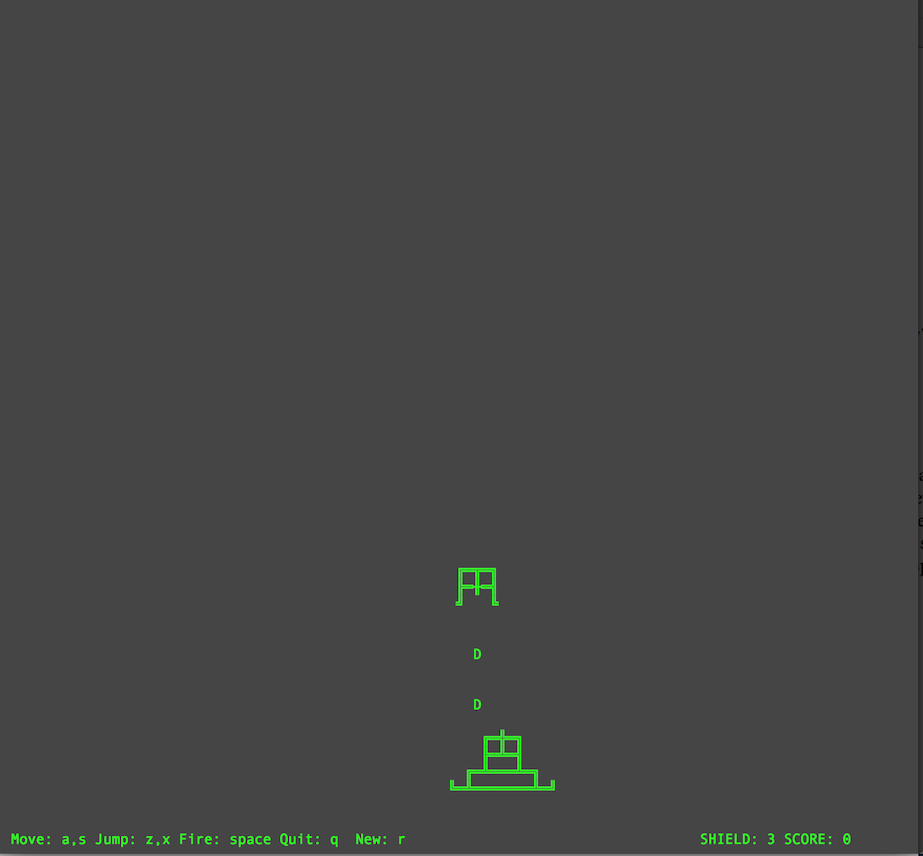
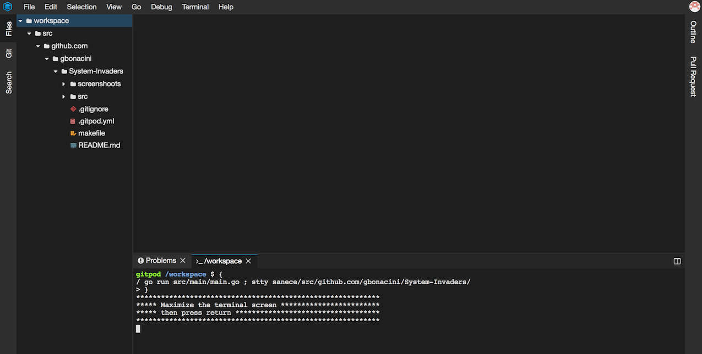
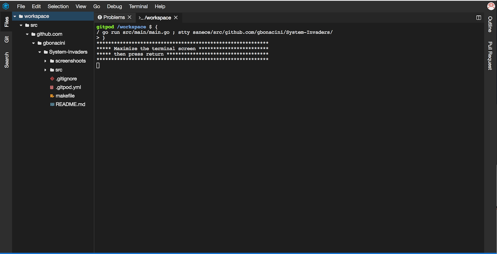
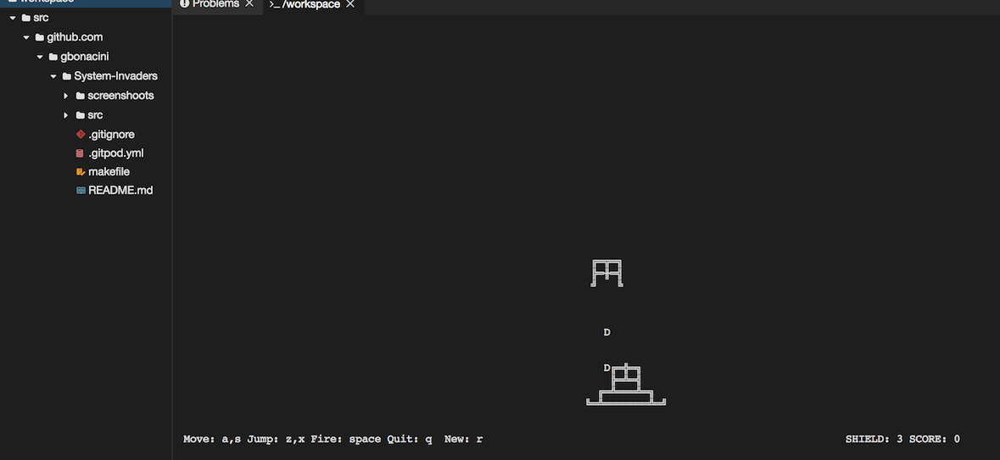

Desctription
============

SystemInvader is a game written in Go, running in a Linux tty.
Beta version.

"The evil dictator of planet D want to conquer your system ! :-) "

Try it on Gitpod
================

Registering an user, you can try it on Gitpod, a free online dev environment for GitHub, using this link:

This is the Docker environment running:

you need to maximaze the terminal window like this:

then you can play without an installation on your pc:

